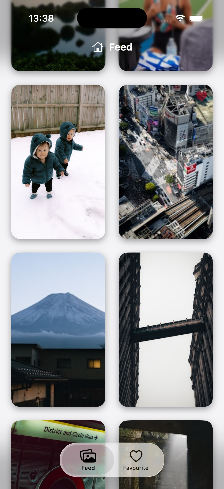
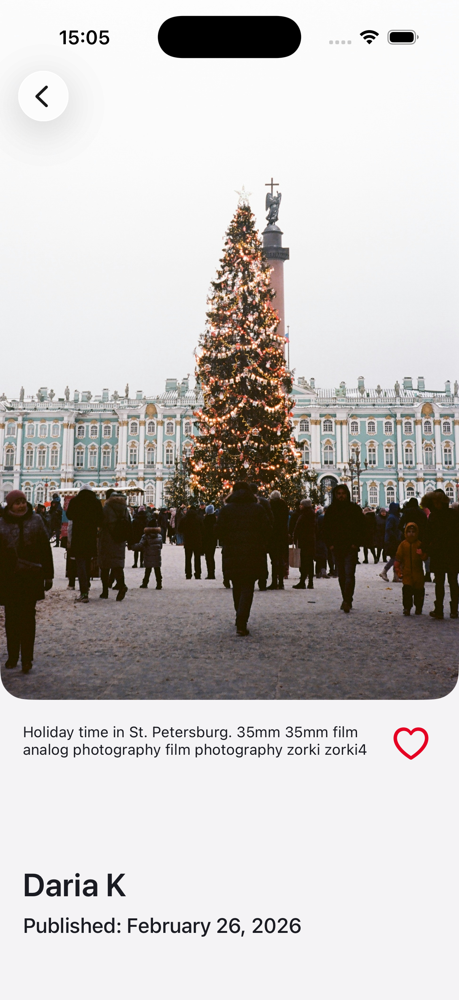
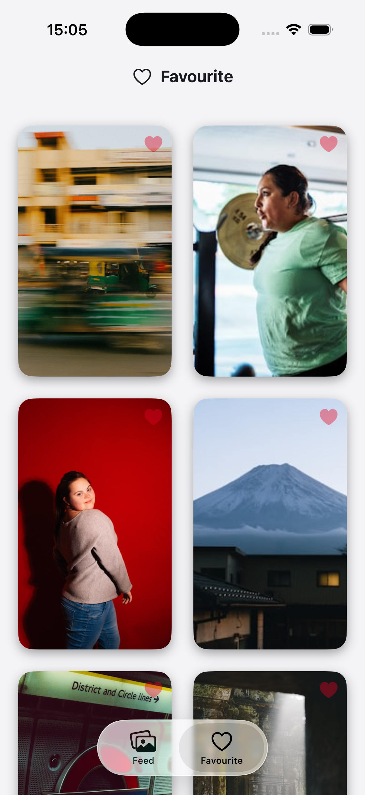

# 📸 Unsplash Gallery App

Приложение для просмотра курируемых фотографий из Unsplash API с возможностью сохранения в "Избранное", реализованное на UIKit.

---

## 👤 Contact Information
* **Name:** Игнат Рогачевич
* **GitHub:** [https://github.com/shogassxzp](https://github.com/shogassxzp)
* **Telegram:** [@shogassxzp](https://t.me/shogassxzp)

---

## 🚀 Project Overview
Приложение представляет собой галерею с бесконечным скроллом (Pagination), детальным просмотром и локальным хранилищем для избранных фотографий.

**Key Features:**
* **Waterfall Layout:** Кастомная динамическая сетка (Pinterest-style) для отображения фото разной высоты.
* **Modern UI (iOS 18 Ready):** Адаптивная навигация. Реализована кастомная кнопка назад с `UIVisualEffectView` для обеспечения читаемости на любом типе контента.
* **Networking:** Пагинация (30 фото на запрос) и обработка состояний загрузки.
* **Image Caching:** Использование Kingfisher для эффективного кеширования и плавности скролла.

---

## 🏗 Architecture & Tech Stack
Проект реализован с использованием паттерна **MVVM**, что обеспечивает четкое разделение бизнес-логики и интерфейса.

* **Language:** Swift 6 / iOS 17+
* **Architecture:** MVVM + Services
* **Database:** CoreData
* **Networking:** URLSession (Generic API Client)
* **UI:** UIKit (Programmatic & Storyboard)
* **Linter:** SwiftLint (все правила соблюдены)
* **Gitflow:** Использование feature-ветвей и Conventional Commits.

---

## 📱 Screenshots

В приложении реализован интуитивно понятный интерфейс, адаптированный под светлую и темную темы оформления iOS 17/18.

| **Лента (Gallery)** | **Детали (Detail)** | **Избранное (Favorites)** |
| :---: | :---: | :---: |
|  |  |  |

---

## 🛠 Configuration
Для корректной работы приложения необходимо настроить API ключи:

1. Добавить файл Keys.plist в папку App внутри проекта

---

## 🧪 Testing & SOLID
* **Unit Tests:** Реализованы тесты для сетевого слоя (parsing) и бизнес-логики `AuthHelper`.
* **D.I. (Dependency Injection):** Сервисы внедряются в ViewModel, что упрощает тестирование.
* **Interface Segregation:** Протоколы используются для абстрагирования сервисов.

