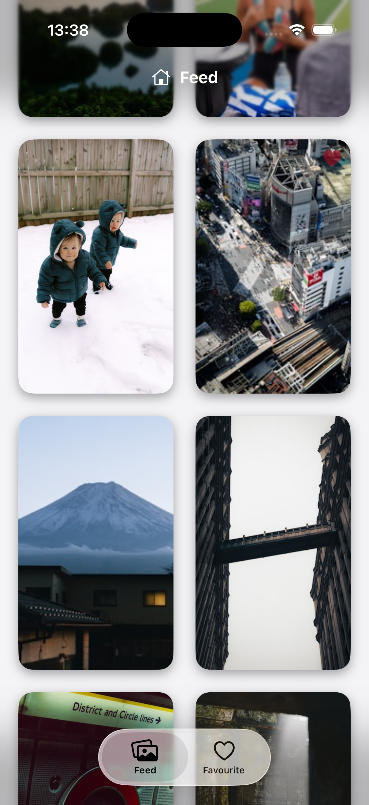
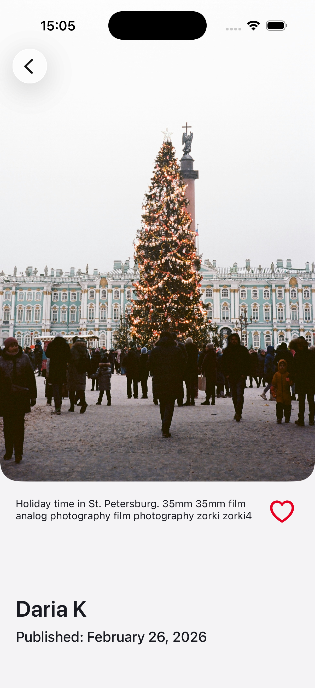
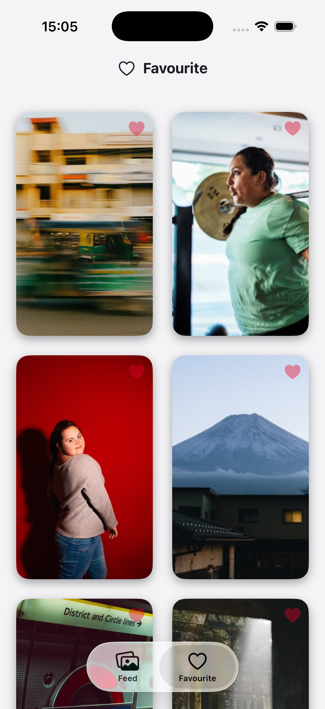

# Unsplash Gallery

Unsplash Gallery is an iOS photo gallery app built with UIKit for an Innowise internship test assignment. The app shows curated photos from the Unsplash API, supports pagination, photo details, and local favorites.

## Screenshots

| Feed | Details | Favorites |
| :---: | :---: | :---: |
|  |  |  |

## Features

- Unsplash OAuth flow
- Curated photo feed
- Infinite scrolling with pagination
- Custom waterfall layout
- Photo details screen
- Add and remove favorites
- Favorites synchronization across screens
- Local persistence with CoreData
- Image caching with Kingfisher
- Double-tap like interaction
- Context menu and haptic feedback
- Light and dark theme support
- Empty states
- Unit tests for services and helpers

## Tech Stack

- Swift 6
- UIKit
- MVVM
- Services layer
- URLSession
- CoreData
- Combine bindings
- Kingfisher
- SwiftKeychainWrapper
- SwiftLint
- XCTest
- iOS 17+

## Architecture

The project uses MVVM with dependency injection. View controllers own rendering and user interaction, view models manage screen state, and services encapsulate networking, OAuth, and storage.

```text
Unsplash Gallery/
├── App/             # AppDelegate, SceneDelegate, constants
├── Presentation/    # Screens, view controllers, view models, tab bar
├── Services/        # Networking, OAuth, token storage, CoreData storage
├── Helperes/        # Shared helpers and protocols
└── Resources/       # Assets, storyboard resources, CoreData model
```

## Key Implementation Details

- `FeedCollection` and `WaterfallLayout` provide a Pinterest-style grid.
- `FeedViewModel` and `FavoritesViewModel` share a common photo feed protocol.
- `ImageListService` handles photo loading, pagination, and like synchronization.
- `StorageManager` stores favorite photos locally.
- `OAuth2TokenStorage` keeps the access token outside regular app state.
- Services are injected into view models, which makes unit tests simpler and avoids hard dependencies on singletons.

## Tests

The repository includes:

- `ImageListServiceTests`
- `ProfileServiceTests`
- `DateFormatterTests`
- `MockURLProtocol`

## Configuration

Create `Keys.plist` inside the `App` folder and add the Unsplash API credentials required by the project.

## Getting Started

1. Open `Unsplash Gallery.xcodeproj` in Xcode.
2. Add `Keys.plist` with API credentials.
3. Select the app scheme.
4. Run on an iOS 17+ simulator.

## Contact

- GitHub: [shogassxzp](https://github.com/shogassxzp)
- Telegram: [@shogassxzp](https://t.me/shogassxzp)

## Repository

[github.com/shogassxzp/Unsplash-Gallery](https://github.com/shogassxzp/Unsplash-Gallery)
